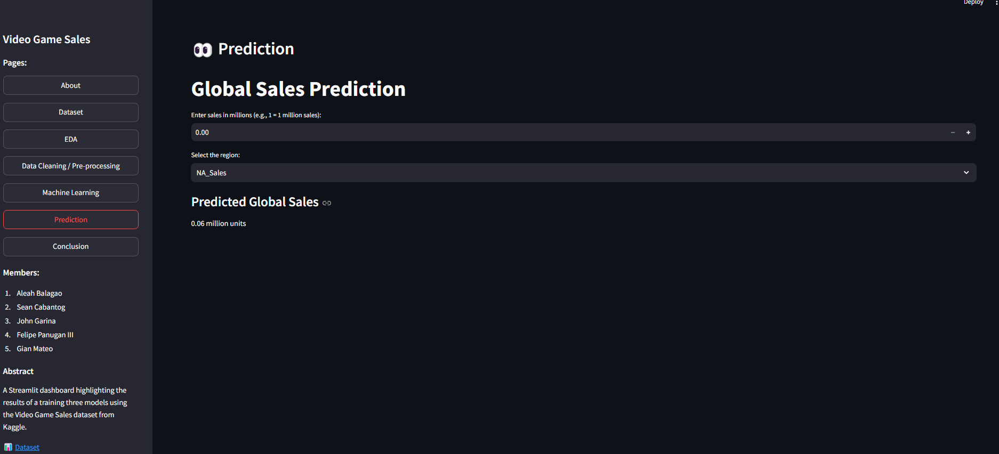

#Contributors:

*Gian Carlo L. Mateo -  Gheyan 

*Aleah H. Balagao -  AHelbes 

*Felipe M. Panugan III - NeoRedcraft 

*Sean Chester Cabantog - sayorikeychains 

*John Daniel D. Garina - Jd3218 

# Video Game Sales Dashboard using Streamlit

A Streamlit web application that performs **Exploratory Data Analysis (EDA)**, **Data Preprocessing**, and **Supervised and Unsupervised Machine Learning** to predict global video game sales, and factors that can affect it using **Linear Regression Models** and **K-means Clustering Models**.

### 🔗 Links:

- 🌐 [Streamlit Link](https://videogamesales.streamlit.app/)
- 📗 [Google Colab Notebook](https://colab.research.google.com/drive/1PinmgyIyVgvNG0V0cNRMxhJbwuC02iPe)

### 📊 Dataset:

- [Video Game Sales Dataset (Kaggle)](https://www.kaggle.com/datasets/gregorut/videogamesales/data)

### 📖 Pages:

1. `Dataset` - Provides a brief description of the Video Game Sales data set that would mainly be used within the whole dashboard.
2. `EDA` - Exploratory Data Analysis of the Video Game Sales dataset. This portion of the dashboard mainly highlights the different relationships between the various columns present within the dataset, providing multiple insights by the use of various graphs as visual representations of the said relationships.
3. `Data Cleaning / Pre-processing` - Various data cleaning and pre-processing were dont as to properly prepare the data before use. Techniques such as null checking and handling, and label encoding were the main things that were used within the dataset.
4. `Machine Learning` - Two models are currently present within the dashboard, which are a supervised model (linear regression) and unuspervised model (k-means clustering).
5. `Prediction` - Within this page, users can input specific values which can map into predictions of global sales for video games.
6. `Conclusion` - Summary of the all the insights gained and observations from the EDA and model training.

### 💡 Findings / Insights

Through exploratory data analysis and training of two classification models which are each a supervised and unsupervised training model (`Linear Regression` and `K-Means Clustering`) on the **Video Game Sales dataset**, the key insights and observations are:

#### 1. 📊 **How profitable is the gaming industry?**:

- 1. Based on a graph we made to show a platform's sales performance in each region, it is shown that video games are currently in demand, specifically in the region of North America.
   
- 2. Between the years 1980 and the early 2000s, video game sales saw a modest yet steady growth, with few titles standing out and exceeding 20 million units sold. Sales peaked between the years 2005 and 2010, driven by things such as blockbuster titles and popular consoles, with some games exceeding 60-80 million units globally. Soon after 2010, there was a decline in top-tier sales, though moderate sales continued to provide steady revenue for most video games.
     
- 3. Our findings mainly show that PS2, as a platform, has the lead in sales, surpassing 1,200 units, with most sales coming from North America. The platofrm X360 ranks second with nearly 1,000 units, also dominated by North American purchases. PS3 follows in third place with sales between 800 and 1,000 units, split between Europe and North America, but still falling behind PS2 despite being a newer platform.

#### 2. 📝 **What factors can contribute to a game's success in sales?**:

- 1. Action, Shooter, and Sports are the usual genres that dominate sales in both North America and Europe, with action games selling over 800 million units in North America. Japan, however, favors Role-Playing, Platform, and Puzzle genres, nearly matching North America in RPG sales. These universal genre trends may suggest that targeting Action, Shooter, and Sports may help to drive success globally, while Role-Playing games are key genre to consider for the Japanese market.

- 2. The insights we gained show that certain platforms and genre combinations perform better in sales. The top three are the Platform genre on Wii (1.6 million), Shooter genre on X360 (1.4 million), and Shooter genre on PS3 (1.3 million). In contrast, the lowest sales are seen with the Puzzle genre on PC (37,000) and Fighting/Platform genres on PC, both averaging 45,000 sales.
     
- 3. In the clustering of genre and global sales, it has formed three clusters which are: 
            - Cluster 0 (Purple), mainly represents the games that have sales below 20 million, primarily there are within the in less popular genres like Simulation, Sports, and Strategy. 
            - Cluster 1 (Cyan), on the other hand also consists of low-sales games under the 20 million mark, which are mainly focused on Action, Adventure, and Fighting genres. 
            - Cluster 2 (Yellow), lastly features games with higher sales above 20 million, which is mostly dominated by popular genres like Platform, Racing, Shooter, and Simulation.

#### 3. 📈 **How can we maximize the sales of a video game?**:

-  1. It is possible to increase a video game's sales performance through platform and genre. Based on a graph we made, mainly to compare between the two features, it shows the popular and in-demand features sought out by buyers.
      
- 2. In a graph comparing the linear regression models of different regions in contribution to global sales, the R² values show how each region's sales correlate with global sales, with NA sales having the strongest correlation. This suggests that if a game sells well in North America, it is likely to succeed globally, making it a key region for maximizing video game sales.
           
- 3. JP sales show a preference for portable gaming, with high sales from the DS. NA sales highlight a preference for powerful consoles like the PS2 and X360. EU sales favor the PlayStation series, with top sales from the PS2 and PS3. In other regions, the PS2 is the most favored platform based on its higher sales compared to others.
           
- 4. Each region shows the genres that are observed as being the most preferred. Action and Sports games sell the best in NA, EU, and Other regions, but not as much in the JP region, where instead, Role-Playing games sell the best. Making Role-Playing games would therefore benefit from the most sales when marketed to the JP region, while Action games will fare better in the NA, EU, and Other region markets.

##### **Summing up:**

Throughout this the creation of the dashboard alongside the different graphs, models, processing and other works that were done within the cycle of the creation process, we have found out that the video game sales data set may have certain values that could really be useful for analyzation to gather relevant information that could help in the process of deciding relevant steps towards video game sales related discussion. Our main model which was the linear regression model that resulted into creating a predictor that could help to provide some insights into predicting global sales based on the different inputs provided, in short this could help to provide valuable information for individuals who may be in this line of discussion.
